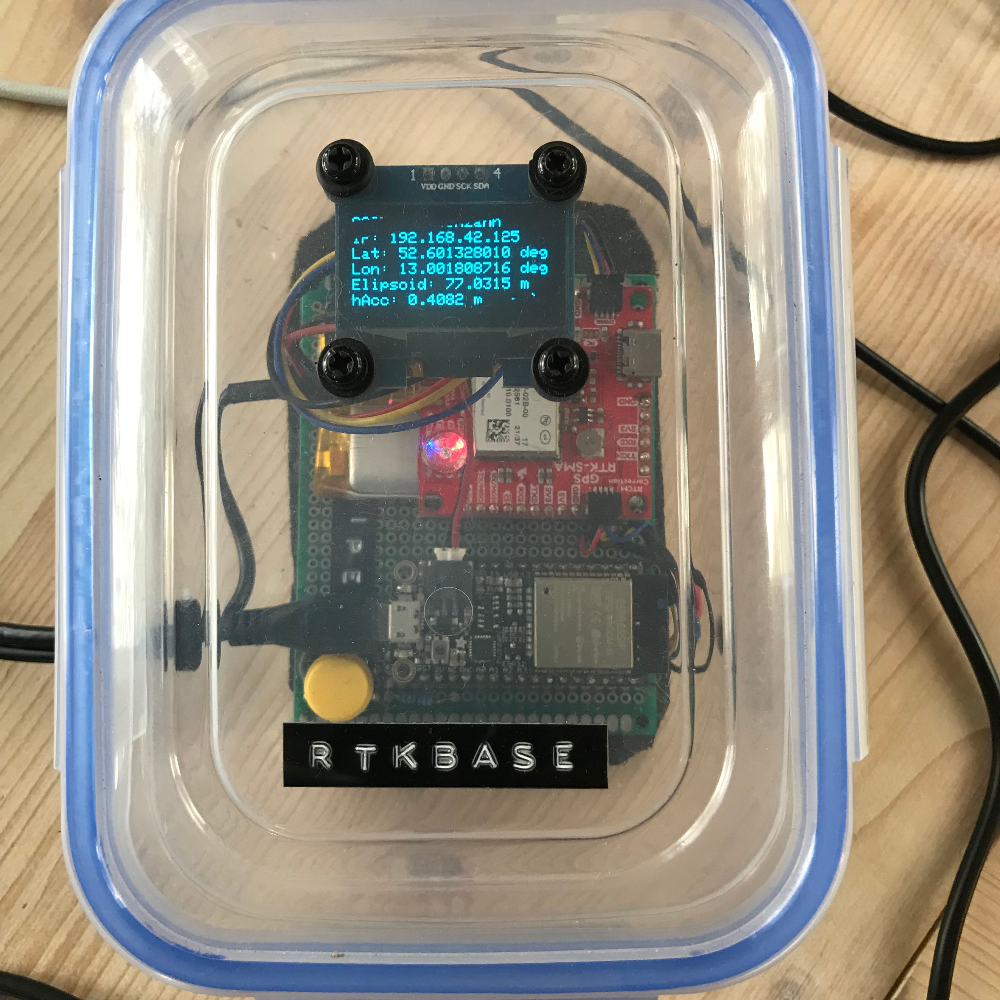
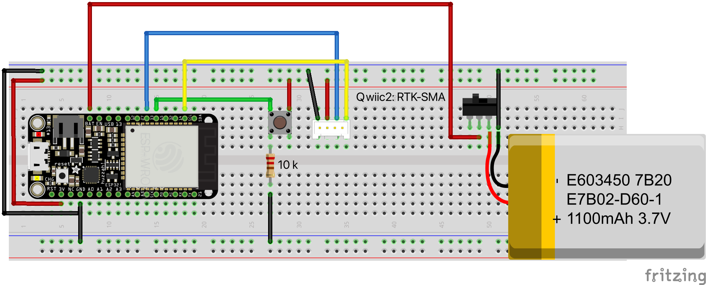

### Real Time Kinematics Base Station (RTK Server)
Hardware used:   
* Adafruit Feather ESP32 Huzzah 
* SparkFun GPS-RTK-SMA Breakout - ZED-F9P (Qwiic)
* ublox ANN-MB1 antenna

Infrastructure:
* reachable WiFi 
* free line of sight between antenna (horizontal placed) at sky 

### Dependencies
* [ESPAsyncWebServer](https://github.com/me-no-dev/ESPAsyncWebServer)
* [RTKBaseManager](https://github.com/jangleboom/RTKBaseManager)

### Circuit diagram


### Caster connection
To connect to a caster you need to create a CasterSecrets.h file with your credentials that looks like this:

````
#ifndef RTK_CASTER_SECRETS_H
#define RTK_CASTER_SECRETS_H

// A place for your caster credentials

// RTK2Go MountPoint http://www.rtk2go.com:2101/SNIP::STATUS#uptime
// Email: YOUR_RTK2GO_ACCOUNT_EMAIL.com
const char kCasterHost[] = "rtk2go.com";
const uint16_t kCasterPort = 2101;
const char kMountPoint[] = "YOUR_RTK2GO_MOUNT_POINT"; //The mount point you want to push data to
// Use "WEEK2208" until your registration is confirmed by the caster
const char kMountPointPW[] = "YOUR_RTK2GO_MOUNT_POINT_PASSWORD"; 

// Or

// Another free NTRIP Caster is Emlid
// Emlid Caster MountPoint
// Email: YOUR_EMLID_ACCOUNT_EMAIL.COM
const char kCasterHost[] = "caster.emlid.com";
const uint16_t kCasterPort = 2101;
const char kMountPoint[] = "YOUR_EMLID_MOUNT_POINT"; //The mount point you want to push data to
const char kMountPointPW[] = "YOUR_EMLID_MOUNT_POINT_PASSWORD";

// Use only one of this choices!

#endif /*** RTK_CASTER_SECRETS_H ***/

````

If you are not using the web form of the RTKRoverManager, then you have to replace the dynamically read credentials with the constant ones (add the k prefix e. g: mountPoint --> kMountPoint) in the main.cpp.

### Usage
Preparation
* make a survey (automatically at first run or you can use the the web form of the RTKBaseManager: Wipe the memory, save and reboot) OR
* set high-precision coordinates of the location of the antenna (you can use the web form of the RTKBaseManager: Enter the high-precision coordinates, save and reboot)